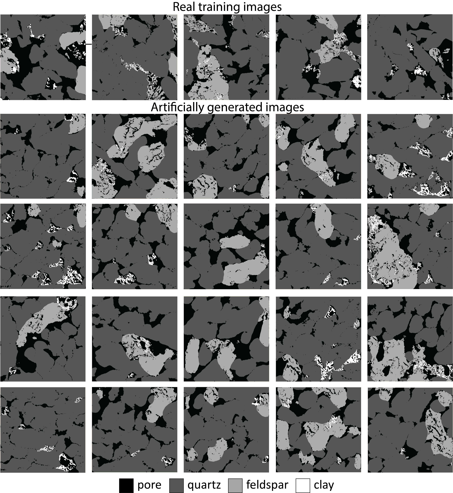

# Overview  

This repository contains information about how to use StyleGAN2ADA to create a training dataset with High-Resolution images of rocks as follow  


# Pre-processing  

Before running the StyleGAN2ADA for generating 2D High-Resolution segmented training dataset, we need to pre-process the microscope images:  

1. Actually, segment the images. We did it manually, in Avizo software, with 4 phases: 0 = pore, 1 = quartz, 2 = fesdspar, and 3 = clay
2. Rescale images before "feeding" them to the StyleGAN2ADA because it was designed to work with 0-255 range. This way, for each segmentatied phase, we give a corresponding value in 0-255 range. You can use ```Step 1``` in the [Post_segmentation_procedure](Post_segmentation_procedure.ipynb) notebook
3. Take the segmented images and extract patches of size 1024x1024 with overlap. You can use ```Step 2``` in the [Post_segmentation_procedure](Post_segmentation_procedure.ipynb) notebook
4. Archive (zip) the obtained images and also put the .json file inside. As example, reference Seg_1024.zip
5. Put the .zip file into the code folder. Now, everything ready to start training StyleGAN2ADA

# Training  

To start the training, use
```
train.py --outdir=training-runs --data=Seg_1024.zip --gpus=4
```
where  

```--outdir``` folder to track network snapshots  

```--data``` zip-archive with training dataset  

```--gpus``` number of available GPUs  

# Post-processing  

After the StyleGAN2ADA is trained and converged, it generates images with values in some range. To use Super-Resolution algorithm, we must put them back into a single-value values for each pixel. For the Super-Resolution code, we should choose 0, 1, 2, 3, etc. For this, You can use ```Step 3``` in the [Post_segmentation_procedure]


